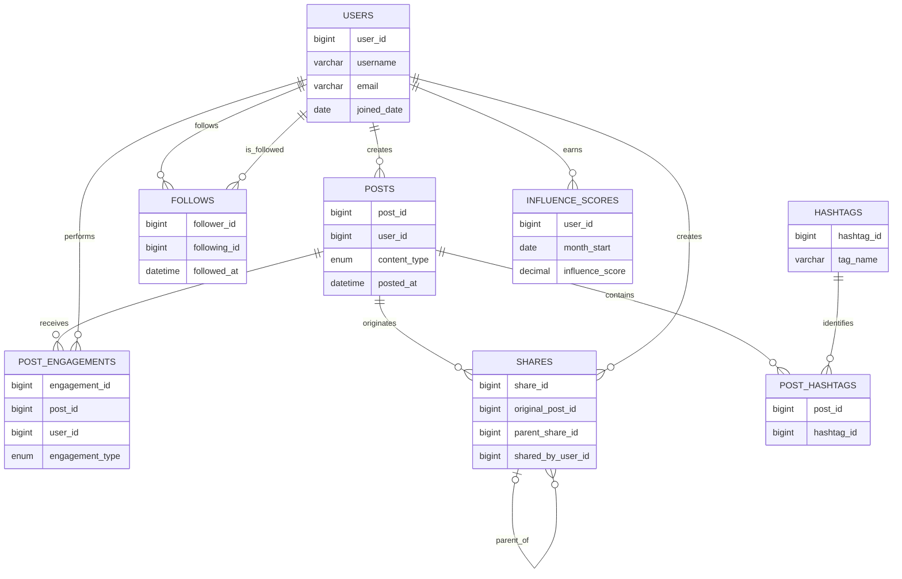

# Social Network Influence & Recommendation Engine

> A MySQL 8 relational-data mini-project that implements a LinkedIn/Instagram-style social graph, connection recommendations, viral-share analysis, and creator influence reporting.

## Overview

This project shows how a conventional relational database can model graph-shaped social data without requiring a graph database. It supports users following users, content publishing, engagement, hashtags, multi-level shares, and monthly influence snapshots.

The project is designed as a **DBMS mini-project** and demonstrates database design, normalization, referential integrity, recursive queries, common table expressions, and window functions.

## Features

- Directed, self-referencing user follow graph.
- Posts with content type and visibility controls.
- Likes, comments, and shares with validation constraints.
- Hashtag-to-post many-to-many relationship.
- Recursive share-chain traversal for viral-reach reporting.
- People-you-may-know recommendations based on mutual connections.
- Persisted monthly creator influence scores and leaderboard ranking.

## Technology

| Component | Choice |
| --- | --- |
| Database | MySQL 8.0+ |
| Storage engine | InnoDB |
| SQL techniques | Foreign keys, CHECK constraints, CTEs, recursive CTEs, window functions |
| Client used | MySQL Workbench |

## Data model



## Repository structure

```text
.
├── assets/
│   └── monthly-leaderboard.png
├── outputs/
│   ├── 01_schema.sql          # Database, tables, keys, constraints, indexes
│   ├── 02_sample_data.sql     # Demonstration dataset
│   ├── 03_monthly_reports.sql # Recommendation, viral reach, leaderboard reports
│   └── README.md              # Concise submission document
└── README.md
```

## Quick start

1. Install **MySQL Server 8.0+** and MySQL Workbench.
2. In Workbench, open and execute the scripts in order:

   ```sql
   outputs/01_schema.sql
   outputs/02_sample_data.sql
   outputs/03_monthly_reports.sql
   ```

3. The first script creates a database named `social_influence_db`. The second inserts sample data; the third runs all reports and writes the monthly influence snapshot.

> The schema script resets only `social_influence_db`, so do not use that database name for unrelated work.

## Database design decisions

- **Normalized design:** entities and many-to-many relationships are stored separately to avoid duplicate data and update anomalies.
- **Referential integrity:** all dependent records use foreign keys. Deleting a user or post cascades only to its related social data.
- **Duplicate protection:** composite primary/unique keys prevent duplicate follows, duplicate post–hashtag mappings, duplicate monthly score snapshots, and repeated actions of the same type on the same post.
- **Data validation:** CHECK constraints prevent self-follows, enforce hashtag format, ensure a score belongs to the first day of a reporting month, and require comment text only for comments.
- **Performance:** indexes accelerate common relationship traversal, timeline, engagement, hashtag, share, and leaderboard lookups.

## Monthly business reports

### 1. People You May Know

Uses a two-hop self-join on `follows` to find candidates reachable through existing connections. Users already followed by the target user and the target user themself are excluded. Results are ordered by number of mutual connection paths.

### 2. Viral share cascade and potential reach

Uses `WITH RECURSIVE` to traverse `shares.parent_share_id`, reporting each layer in a share cascade. The report estimates potential new viewers as the follower count of each person who shares the post. A depth cap and path check protect against accidental cyclic data.

### 3. Monthly influencer leaderboard

Uses CTEs to aggregate the reporting month's posts and engagement, combines those metrics with follower count, stores the snapshot in `influence_scores`, and ranks creators using `RANK()`.

**Influence score formula**

```text
0.30 × followers
+ 0.50 × (average engagements per post ÷ followers × 100)
+ 0.20 × posts published in the month
```

Weights are deliberately separated from the schema so a business can change ranking policy without redesigning the database.

## Result screenshot

The MySQL Workbench output below confirms that the report script completed successfully: it generated the viral cascade, inserted six monthly snapshots, and returned the monthly leaderboard.


## Future enhancements

- Add a scheduled event or stored procedure to refresh monthly snapshots automatically.
- Add moderation and notification tables.
- Track impressions separately from potential reach.
- Add post deletion/audit history and soft-delete support.
- Build a dashboard API on top of the reporting queries.

## Author

Allen Stivanson Christian — DBMS Mini-Project

## License

This repository is provided for academic and portfolio use.
